## iOS Application Rendering: A Deep Dive

This document provides an exploration of the iOS application rendering pipeline, from high-level UIKit API calls to the final presentation of pixels on the physical display. Areas of discussion include layer-based compositing, scene management, rendering and state synchronization, animation coordination, and input event handling.

---

**Table of Contents**

1. **Introduction & Architectural Overview**  
    * Purpose  
    * Core Rendering Paradigm  
    * Key Abstractions: Views, Layers, Contexts, and Scenes  
    * The Client-Server Model for UI Management  
    * High-Level Rendering Flow  

2.  **UIKit Interface and Layer Fundamentals** 
    * UIKit: The Application's Interface  
        * `UIView`: The Building Block  
        * `UIWindow`: The Root and System Interface  
        * Mapping View Properties to Layers   
    * QuartzCore Foundation: CALayer and CAContext  
        * `CALayer`: The Atomic Unit of Rendering  
        * Layer Geometry, Hierarchy, and Content  
        * Visual Effects and Specialized Layer Types  
        * `CAContext`: The Bridge to the Render Server  
        * The Significance of the `contextID`  

3.  **Scene Management Architecture**  
    * The Scene Abstraction and Client-Server Model  
        * `FBSScene` (Client) and `FBScene` (Server)  
        * `UIWindow`'s Link to Scene Management  
        * Scene Content Association via `FBSCAContextSceneLayer`  
    * Scene State Synchronization and Communication  
        * Settings Objects and Diffing  
        * `FBSWorkspace` and `FBSceneManager`  
        * Scene Hosting and Remote Rendering  
    * Transactional Operations and Scene Lifecycle  

4.  **Synchronization, Animation, and Cross-Process Coordination**  
    4.1. `CATransaction` and `CAAnimation` Fundamentals  
    4.2. `FBSSceneTransitionContext`: Coordinated Scene State Changes  
    4.3. `BKSAnimationFenceHandle`: Ensuring Visual Cohesion  
        4.3.1. Fence Creation and Management  
        4.3.2. `UIWindow`'s Role in Fence Coordination  

5.  **The Render Server, Compositing, and Display Hardware**  
    5.1. The Render Server: Conceptual Overview  
    5.2. Display Abstractions and Layout Management  
    5.3. Final Output: From Composited Scene to Pixels  

6.  **Input Event Handling in the Rendering Context**  
    6.1. BackBoardServices and `BKSHIDEvent`  
    6.2. Event Routing via `contextID` and `BKSEventFocusManager`  
    6.3. `UIWindow` as the Event Target  

7.  **Specialized Rendering Paths and Considerations**  
    7.1. Direct GPU Rendering: `CAMetalLayer` and `CAOpenGLLayer`  
    7.2. Hosted UIKit Environments (UIKitSystemAppServices)  
    7.3. Scene Snapshots for System Operations 

8.  **Conclusion and Key Interaction Visualizations**  
    8.1. Summary of Rendering Flow  
    8.2. Visualized Scenarios  

---

### 1. Introduction & Architectural Overview

#### 1.2. Core Rendering Paradigm
iOS employs a sophisticated, layer-based compositing model. Applications construct a hierarchy of layers, each representing a distinct piece of visual content. These layer trees are then managed, composited, and rendered by system services to produce the final image seen by the user. This architecture allows for efficient updates, complex animations, and seamless integration of UI from multiple sources (e.g., different applications, system UI).

#### 1.3. Key Abstractions: Views, Layers, Contexts, and Scenes
The rendering system is built upon several key abstractions:

*   **`UIView` (UIKit):** The primary object applications use to define and manage UI elements and their event handling.
*   **`CALayer` (QuartzCore):** The backing for every `UIView`, `CALayer` is the fundamental unit for 2D and 3D drawing, animation, and compositing. It holds content (like an image or custom drawing) and visual attributes.
*   **`CAContext` (QuartzCore):** Represents an independent rendering destination managed by the system's Render Server. Each `UIWindow` typically manages a `CAContext` into which its `CALayer` tree is rendered. The `contextID` of a `CAContext` is a crucial system-wide identifier.
*   **`FBSScene` / `FBScene` (FrontBoardServices/FrontBoard):** An abstraction representing a managed area on a display where an application can present its content. An `FBSScene` is the application's handle to this managed area, while an `FBScene` is the system-side (FrontBoard) representation.

#### 1.4. The Client-Server Model for UI Management
UI presentation and window management in iOS operate on a client-server model:

*   **Client (Application):** The application process, using UIKit and FrontBoardServices, defines its UI and interacts with the system to request display space and manage its presentation.
*   **Server (System Services - primarily FrontBoard):** A system process (often part of SpringBoard) that manages system-wide UI state, orchestrates scenes from multiple applications, handles window layering, and interfaces with the Render Server.

This separation allows the system to manage resources, security, and overall UI coherence, while applications focus on their specific content and interactions. Communication between the client and server typically occurs via XPC and Mach port-based mechanisms.

#### 1.5. High-Level Rendering Flow
A simplified view of the rendering flow is as follows:

1.  An application, using UIKit, constructs a view hierarchy (`UIView` instances).
2.  Each `UIView` is backed by a `CALayer`. These layers form a tree.
3.  The `UIWindow`'s `CALayer` tree is rendered into a `CAContext` managed by the window.
4.  The application, via FrontBoardServices (`FBSScene`, `FBSWorkspace`), communicates its desire to present this `CAContext` (identified by its `contextID`) to FrontBoard.
5.  FrontBoard (`FBSceneManager`, `FBScene`) receives this request and manages the "hosting" of the application's `CAContext`. It instructs the Render Server.
6.  The Render Server composites the content from various `CAContext`s (from the app, other apps, system UI) into a final frame buffer.
7.  The frame buffer is sent to the display hardware.

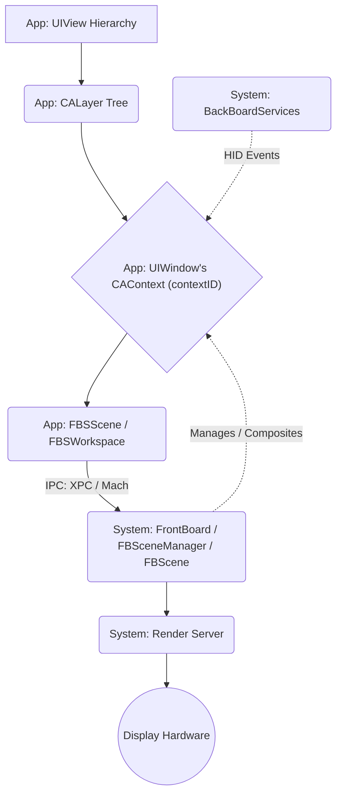

### 2. UIKit Interface and Layer Fundamentals

#### 2.1. UIKit: The Application's Interface

UIKit provides the high-level framework for application development, abstracting many of the complexities of direct graphics manipulation and system interaction.

##### 2.1.1. `UIView`: The Building Block
`UIView` is the cornerstone of an application's user interface. Developers create instances of `UIView` (or its subclasses like `UILabel`, `UIButton`, `UIImageView`) to represent distinct visual elements. Key aspects include:

*   **Hierarchy:** Views are arranged in a tree structure, with a superview and multiple subviews. This hierarchy dictates drawing order (subviews are drawn on top of their superview) and event propagation.
*   **Geometry:** Properties like `frame` (position and size in superview's coordinates), `bounds` (local drawing rectangle), and `transform` (affine transform relative to its center) define a view's spatial characteristics.
*   **Appearance:** Properties like `backgroundColor`, `alpha` (opacity), and `isHidden` control visual presentation.
*   **Drawing:** Custom drawing is achieved by overriding `drawRect:`. When a view needs to be redrawn (e.g., due to `setNeedsDisplay` being called), UIKit sets up a graphics context and invokes this method.
*   **Event Handling:** Views are `UIResponder` subclasses, capable of handling touch events, motion events, and other input.

##### 2.1.2. `UIWindow`: The Root and System Interface
`UIWindow` is a specialized `UIView` subclass that serves as the top-level container for an application's view hierarchy. It doesn't typically have visible content itself but acts as a bridge to the system's windowing and rendering infrastructure.

*   **Root View Controller:** A `UIWindow` usually has a `rootViewController`, whose view becomes the primary content view of the window.
*   **Screen Association:** A `UIWindow` is associated with a `UIScreen`, determining which physical display it will appear on.
*   **Window Level:** The `windowLevel` property (e.g., `UIWindowLevelNormal`, `UIWindowLevelStatusBar`, `UIWindowLevelAlert`) dictates its Z-ordering relative to other windows on the screen. System services use this for global UI layering.
*   **Key Window Status:** Only one window at a time is the "key window." The key window receives keyboard and non-touch-related UI events. Making a window key (`makeKeyAndVisible`) involves communication with system services.
*   **Interface Orientation:** The `UIWindow`, often in conjunction with its `rootViewController` and application settings, manages the interface orientation of its content.

##### 2.1.3. Mapping View Properties to Layers
Every `UIView` instance is backed by a `CALayer` object. Changes to `UIView` properties are typically translated into corresponding changes on its underlying `CALayer`. UIKit manages this mapping, often batching layer updates through `CATransaction`s for efficiency.

#### 2.2. QuartzCore Foundation: CALayer and CAContext

QuartzCore provides the `CALayer` class and `CAContext` infrastructure for hardware-accelerated compositing and animation. This foundation bridges UIKit's view-based interface with the system's render server.

##### 2.2.1. `CALayer`: The Atomic Unit of Rendering
`CALayer` is the fundamental object that QuartzCore uses to represent 2D and 3D content. Unlike `UIView`, `CALayer` is not a `UIResponder` and does not handle user interaction directly; its focus is solely on content presentation and animation.

**Layer Geometry and Hierarchy:**
*   **`bounds`**: The layer's drawing rectangle in its own coordinate system.
*   **`position`**: The position of the layer's `anchorPoint` in its superlayer's coordinate system.
*   **`anchorPoint`**: A normalized point (0,0 to 1,1) within the layer that `position` refers to and around which transformations (like rotation) occur. Defaults to (0.5, 0.5), the center.
*   **`transform` (`CATransform3D`)**: An arbitrary 3D transformation matrix applied to the layer and its sublayers.
*   **`frame`**: A derived property representing the layer's extent in its superlayer's coordinate system, calculated from `bounds`, `position`, `anchorPoint`, and `transform`.
*   **`sublayers`**: An array of child `CALayer`s.
*   **`superlayer`**: The parent `CALayer`.
*   **`zPosition`**: Affects the front-to-back ordering of sibling layers without true 3D perspective (unless within a `CATransformLayer`).

**Layer Content and Visual Effects:**
A `CALayer` can display content through multiple mechanisms:

*   **`contents` property**: Can be assigned a `CGImageRef` (or platform-specific types like `IOSurfaceRef`). This image is drawn into the layer's bounds, respecting `contentsGravity`, `contentsScale`, and `contentsRect`.
*   **Custom Drawing (`drawInContext:`)**: A `CALayer` subclass can override `drawInContext:`, or its delegate can implement `drawLayer:inContext:`. Core Animation creates a graphics context (`CGContextRef`) representing the layer's backing store when content updates are needed.
*   **`backgroundColor`**: A `CGColorRef` that fills the layer's bounds.
*   **`borderColor` / `borderWidth`**: Defines a border drawn around the layer's bounds.

Visual effects properties include:
*   **`opacity`**: Controls transparency of the layer and its sublayers.
*   **`cornerRadius`**: Creates rounded corners. If `masksToBounds` is `YES`, content outside these corners is clipped.
*   **`shadowColor`, `shadowOpacity`, `shadowOffset`, `shadowRadius`, `shadowPath`**: Properties for rendering drop shadows.
*   **`mask`**: Another `CALayer` whose alpha channel masks the receiver's content.
*   **`filters`, `backgroundFilters`, `compositingFilter`**: Arrays of `CAFilter` objects for advanced visual effects.

**Specialized CALayer Subtypes:**
QuartzCore offers specialized `CALayer` subclasses for specific rendering tasks:

*   **`CATextLayer`**: Renders plain or attributed strings.
*   **`CAShapeLayer`**: Renders shapes defined by `CGPathRef`, with stroke and fill properties.
*   **`CAGradientLayer`**: Draws color gradients.
*   **`CAMetalLayer` / `CAOpenGLLayer`**: Provide surfaces for direct GPU rendering, critical for games and graphics-intensive applications.
*   **`CATiledLayer`**: Efficiently draws very large content by breaking it into tiles loaded on demand.
*   **`CALayerHost`**: Displays content of a `CAContext` from potentially another process, identified by its `contextId`. Fundamental for remote hosting.
*   **`CATransformLayer`**: Allows true 3D perspective in its sublayer hierarchy, unlike standard `CALayer` which flattens children.

##### 2.2.2. `CAContext`: The Bridge to the Render Server
A `CAContext` is the object that embodies an independent rendering surface and layer tree managed by the system's Render Server. Each `UIWindow` typically creates and manages its own `CAContext`, into which its entire `CALayer` tree is rendered.

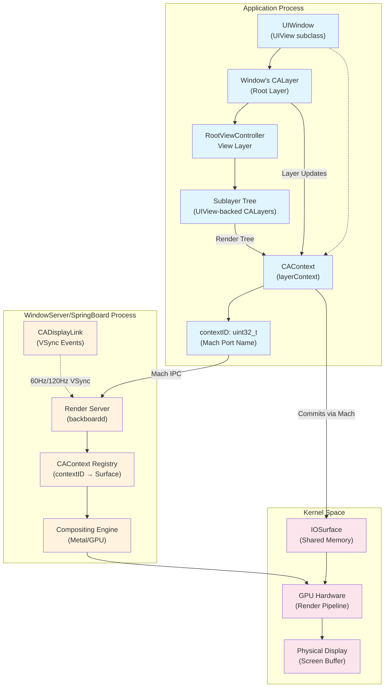

**The Significance of the `contextID`:**
The `contextId` property of a `CAContext` is a unique 32-bit integer that serves as the critical bridge between an application's UI and the system's rendering infrastructure:

*   **Render Server Identification:** It's how the Render Server (a separate system process) identifies and manages the specific drawing surface associated with that part of the application's UI.
*   **Inter-Process Referencing:** System services like FrontBoard use this `contextID` to refer to and manipulate an application's renderable content without needing direct access to the app's `CALayer` objects. This enables remote hosting and scene management.
*   **Event Routing:** BackBoardServices uses the `contextID` of the focused window/layer to route touch and other hardware events to the correct application and specific part of its UI.

For standard applications, the context associated with a `UIWindow` is effectively a remote rendering target managed by the system, where rendering commands are sent to the Render Server for compositing.

### 3. Scene Management Architecture

While `CAContext` provides a renderable surface, the *management* of an application's overall presence on screen, its lifecycle, and its interaction with other UI elements is handled at a higher level by "Scenes," orchestrated by the FrontBoard framework using a client-server architecture.

#### 3.1. The Scene Abstraction and Client-Server Model

iOS uses a scene-based model for managing application UI, where each scene represents a distinct, manageable unit of an application's interface. This system operates through paired client and server objects:

**Client Side (Application Process):**
*   **`FBSScene` (FrontBoardServices):** The application-side object representing a scene. Applications interact with `FBSScene` objects to manage settings, send actions, and respond to system-initiated updates.
*   **`FBSWorkspace`:** The primary channel for scene communication with the system, allowing apps to enumerate existing scenes, request creation/destruction of scenes, and receive lifecycle events via `FBSWorkspaceDelegate`.

**Server Side (FrontBoard Process):**
*   **`FBScene` (FrontBoard):** The server-side counterpart managing the scene within the system. FrontBoard manages collections of `FBScene` objects representing all active scenes from various applications and system services.
*   **`FBSceneManager`:** The core object overseeing all `FBScene` instances, handling creation/destruction requests, settings adjudication, and observer notifications.

Each scene is uniquely identified by a string `identifier` and often a `workspaceIdentifier`.

#### 3.2. Scene Content Association via `FBSCAContextSceneLayer`

The critical link between a `UIWindow`'s `CAContext` and the scene management system occurs through scene layers:

*   When a `UIWindow` is made visible and associated with an `FBSScene`, its `_layerContext` (a `CAContext`) is represented within that `FBSScene` as an `FBSCAContextSceneLayer`.
*   The `FBSCAContextSceneLayer` carries the `contextID` of the window's `CAContext`.
*   This `contextID` is the critical piece of information that allows FrontBoard (managing the server-side `FBScene`) to identify and display the actual rendered content from the application's process.

Additional layer types include `FBSExternalSceneLayer`, which allows one scene to embed content from another scene (identified by its `sceneID`), enabling features like Picture-in-Picture or Split View.

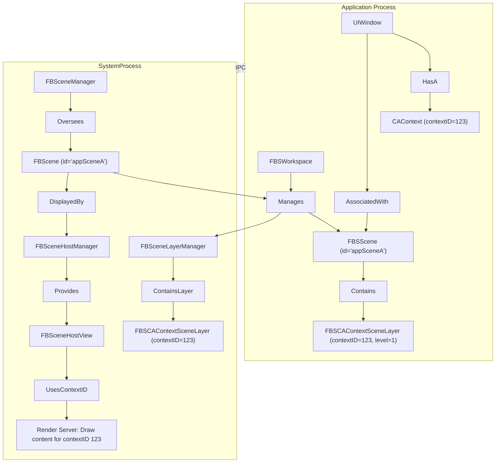

#### 3.3. Scene State Synchronization and Communication

The state and appearance of scenes are managed through settings objects synchronized between the application (client) and FrontBoard (server):

**Settings Objects:**
*   **`FBSSceneSettings` (Server-Controlled):** Describe the system-imposed state including `displayIdentity`, `frame`, `level` (Z-ordering), `interfaceOrientation`, `backgrounded` status, and `occlusions`.
*   **`FBSSceneClientSettings` (Client-Controlled):** Communicate the application's preferences including `preferredLevel`, `preferredInterfaceOrientation`, and internal `occlusions`.

**Efficient Updates:**
Changes are transmitted as diff objects (`FBSSceneSettingsDiff`, `FBSSceneClientSettingsDiff`) with inspectors allowing observers to efficiently determine which specific settings changed.

**Communication Flow:**
When an application updates its `FBSSceneClientSettings`, FrontBoard processes the request, updates its server-side `FBSceneSettings` if valid, and propagates changes back to the application. The `FBSWorkspace` serves as the primary communication channel, handling scene enumeration, creation/destruction requests, and lifecycle events via `FBSWorkspaceDelegate`.

#### 3.4. Scene Hosting and Remote Rendering

The server-side scene management enables remote rendering through several key components:

**FBSceneLayerManager:** Each `FBScene` maintains an ordered set of `FBSSceneLayer` objects, primarily `FBSCAContextSceneLayer` (representing main content) and `FBSExternalSceneLayer` (for embedded content from other scenes).

**FBSceneHostManager:** Responsible for actual presentation of scene content within FrontBoard's UI hierarchy. It manages requests from multiple "requesters" wanting to display the scene content and provides `FBSceneHostView` instances.

**FBSceneHostView:** A `UIView` subclass within the FrontBoard process that displays client application scene content using the `contextID` from the `FBSCAContextSceneLayer`. The `FBSceneHostAppearance` protocol defines rendering properties like `renderingMode`, `minificationFilterName`, and `appearanceStyle`.

#### 3.5. Transactional Operations and Scene Lifecycle

FrontBoard uses its own transaction system, built upon `BSTransaction` from BaseBoard, to manage complex operations involving multiple steps or asynchronous work:

*   **`FBTransaction`:** Base class for FrontBoard-specific transactions.
*   **`FBApplicationProcessLaunchTransaction`:** Manages application process launch as part of scene updates.
*   **`FBUpdateSceneTransaction`:** Coordinates single scene updates, including settings changes and client commit synchronization.
*   **`FBApplicationUpdateScenesTransaction`:** Comprehensive transaction managing application launch and creation/update of multiple scenes simultaneously, often acting as a synchronized group (`FBSynchronizedTransactionGroup`).

These transactions ensure operations like app opening and initial UI display occur in a coordinated, well-defined manner. The underlying remote layer architecture uses `CARemoteLayerClient` and `CARemoteLayerServer` mechanisms, where the `contextID` serves a similar purpose to `clientId` in efficiently referencing and compositing layer trees from different processes.

### 4. Synchronization, Animation, and Cross-Process Coordination

Smooth UI and animations, especially during transitions involving multiple processes, require careful coordination. iOS employs several layers of transactional and synchronization mechanisms.

#### 4.1. `FBSceneManager`: Central Scene Authority
The `FBSceneManager` is the core object within FrontBoard that oversees all `FBScene` instances. Its responsibilities include:

*   **Scene Creation and Destruction:** Handling requests from applications (via `FBSWorkspace`) and other system services to create or destroy scenes. When creating a scene, it uses an `FBSSceneDefinition` (which includes the client's identity and a specification for the scene type) and `FBSSceneParameters` (initial settings).
*   **Settings Adjudication:** Receiving `FBSSceneClientSettings` updates from applications, validating them against system policies, and applying corresponding changes to the server-side `FBSceneSettings`.
*   **Dispatching Updates:** Sending `FBSceneSettings` updates (and diffs) back to the client applications.
*   **Observer Notification:** Informing interested parties (via `FBSceneManagerObserver`) about scene lifecycle events (creation, destruction, updates).
*   **Synchronization:** `FBSceneManager` allows changes to be synchronized (`synchronizeChanges:`) to ensure atomicity of multiple scene operations.

#### 4.2. `FBScene`: Server-Side Scene Representation
An `FBScene` is FrontBoard's internal representation of a scene. It mirrors the client-side `FBSScene` but has additional responsibilities related to system-level management.

##### 4.2.1. `FBSceneLayerManager`: Aggregating Scene Content
Each `FBScene` has an `FBSceneLayerManager` that maintains an ordered set of `FBSSceneLayer` objects. This manager tracks layers associated with the scene, primarily:

*   **`FBSCAContextSceneLayer`:** Representing the main content context (`contextID`) from the client application.
*   **`FBSExternalSceneLayer`:** Representing content from other scenes that might be embedded or hosted within this scene.

The `FBSceneLayerManager` informs observers (`FBSceneLayerManagerObserver`) about changes in the layer composition or ordering.

##### 4.2.2. `FBSceneHostManager`: Displaying Scene Content
A key component of an `FBScene` is its `FBSceneHostManager`. This manager is responsible for the actual presentation of the scene's content within FrontBoard's own UI hierarchy (or another hosting process).

*   It manages requests from various "requesters" (identified by strings) that want to display the scene's content.
*   It determines which requester has priority if multiple entities want to host the same scene.
*   It provides `FBSceneHostView` instances to these requesters.

#### 4.3. Scene Hosting and Remote Rendering

##### 4.3.1. `FBSceneHostView` and `CAContextID`
An `FBSceneHostView` is a `UIView` subclass (or a similar platform-specific view) within the FrontBoard process (or another hosting process) that is responsible for displaying the content of a client application's scene.

*   It receives the `contextID` of the client's `CAContext` (via the `FBSCAContextSceneLayer` managed by the `FBScene`).
*   It uses this `contextID` to instruct the Render Server to draw the content associated with that context.
*   The `FBSceneHostAppearance` protocol, implemented by `FBSceneHostView`, defines properties like `renderingMode`, `minificationFilterName`, and `hostedLayerTypes` that control how the client's content is rendered and composited. The `appearanceStyle` can dictate whether the hosted content is based on reference bounds or current bounds.

This mechanism allows FrontBoard to display an application's UI without having direct access to the application's `CALayer` objects, only needing the `contextID` to refer to its rendering output.

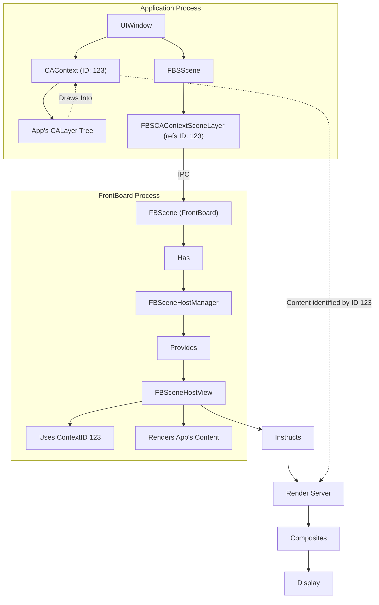

##### 4.3.2. The Role of `CARemoteLayerClient` and `CARemoteLayerServer` (QuartzCore)
While not directly part of FrontBoard's public API, these QuartzCore classes provide an underlying mechanism for how a `CAContext` from one process (the app) can have its layer tree rendered and composited by another process (the Render Server, orchestrated by FrontBoard).

*   **`CARemoteLayerClient`:** An application might implicitly use or be wrapped by something akin to a `CARemoteLayerClient` when its `CAContext` is intended for display by the system. The client would manage its `layer` (the root of its renderable tree) and have a `clientId`.
*   **`CARemoteLayerServer`:** The system (FrontBoard/Render Server) would act as a `CARemoteLayerServer`. It can then create a special `CALayer` (via `+[CALayer layerWithRemoteClientId:]`) that acts as a placeholder for the client's content.

The `contextID` of a `CAContext` serves a similar purpose to the `clientId` in this remote layer architecture, enabling the system to efficiently reference and composite layer trees from different processes.

#### 4.4. Transactional Operations in FrontBoard
FrontBoard uses its own transaction system, built upon `BSTransaction` from BaseBoard, to manage complex operations that may involve multiple steps or asynchronous work.

*   **`FBTransaction`:** A base class for FrontBoard-specific transactions.
*   **`FBApplicationProcessLaunchTransaction`:** Manages the launch of an application process if it's not already running as part of a scene update.
*   **`FBUpdateSceneTransaction`:** Coordinates the update of a single scene, including changes to its settings and potentially waiting for the client to commit its corresponding client settings.
*   **`FBApplicationUpdateScenesTransaction`:** A more comprehensive transaction that can manage the launch of an application and the creation/update of multiple scenes for that application simultaneously. It often acts as a synchronized group (`FBSynchronizedTransactionGroup`) for multiple underlying `FBUpdateSceneTransaction` instances and an `FBApplicationProcessLaunchTransaction`.

These transactions ensure that operations like opening an app and displaying its initial UI occur in a coordinated and well-defined manner.

### 5. Transactions, Animations, and Cross-Process Synchronization

Smooth UI and animations, especially during transitions involving multiple processes, require careful coordination. iOS employs several layers of transactional and synchronization mechanisms.

#### 5.1. `CATransaction` (QuartzCore)
`CATransaction` is the fundamental mechanism in QuartzCore for batching changes to `CALayer` properties and ensuring they are applied atomically to the render tree.

*   **Implicit Transactions:** Most `CALayer` property changes made on the main thread are automatically wrapped in an implicit transaction. This transaction is typically committed at the end of the current run loop cycle.
*   **Explicit Transactions:** Developers can use `[CATransaction begin]` and `[CATransaction commit]` to define explicit transaction scopes, allowing finer control over when a batch of changes is applied. `[CATransaction flush]` can force an implicit transaction to commit earlier.
*   **Animation Properties:** `CATransaction` allows setting per-transaction properties like:
    *   `animationDuration`: The default duration for animations created implicitly during this transaction.
    *   `animationTimingFunction`: A `CAMediaTimingFunction` (e.g., ease-in, ease-out) to control the pacing of implicit animations.
    *   `completionBlock`: A block to be executed after all animations started within the transaction have completed.
    *   `disableActions`: A boolean to temporarily suppress the creation of implicit animations for property changes.

When a `CATransaction` is committed, the changes to layer properties are sent to the Render Server.

#### 5.2. `CAAnimation` (QuartzCore)
`CAAnimation` and its subclasses (`CABasicAnimation`, `CAKeyframeAnimation`, `CASpringAnimation`, `CAAnimationGroup`, `CATransition`) define how layer properties change over time.

*   Animations are added to layers using `-[CALayer addAnimation:forKey:]`.
*   When a property an animation is targeting changes, the animation controls how the layer interpolates from its current presentation value to the new model value.
*   The timing of animations is governed by the `CAMediaTiming` protocol, which `CAAnimation` and `CALayer` conform to (begin time, duration, speed, repeat count, autoreverses, fill mode).

#### 5.3. `FBSSceneTransitionContext`: Coordinated Scene State Changes
When an application or FrontBoard initiates a change to scene settings (e.g., resizing a window, changing its orientation, or activating a scene), these changes are often bundled within an `FBSSceneTransitionContext`.

*   **`animationSettings` (`BSAnimationSettings`)**: This property within the context can specify the duration, delay, and timing function (including spring parameters for `BSSpringAnimationSettings`) for how the scene's visual representation should transition to the new state. FrontBoard uses these settings when animating the `FBSceneHostView`.
*   **`actions` (`NSSet<BSAction *>`)**: The context can carry a set of `BSAction` objects to be delivered to the scene's client or host as part of the transition.
*   **`animationFence` (`BKSAnimationFenceHandle`)**: Crucially, an `FBSSceneTransitionContext` can include an animation fence.

#### 5.4. `BKSAnimationFenceHandle`: Ensuring Visual Cohesion
`BKSAnimationFenceHandle` (often aliased as `FBSCAFenceHandle`) is a vital mechanism for synchronizing animations and rendering updates across different processes or even across different `CAContext`s within the same process.

*   **Purpose:** When a complex UI transition involves multiple independent entities animating (e.g., an application animating its content while the system (FrontBoard) animates the window frame), fences ensure these animations appear visually coordinated. One part of the animation won't complete and "jump" before another part is ready.
*   **Mechanism:**
    1.  A fence handle represents a reference to an underlying synchronization primitive managed by the system.
    2.  A `CAContext` can create a Mach port representing a new fence via `createFencePort`. This port is the "trigger" for the fence.
    3.  This fence port (or a `BKSAnimationFenceHandle` wrapping it) can be associated with a `CATransaction` in one or more `CAContext`s using `setFencePort:`.
    4.  A `CATransaction` that has a fence set will *not* allow its changes to be fully committed and made visible by the Render Server until the corresponding fence is "signaled" or "cleared."
    5.  The fence is typically signaled when all parties holding a reference (a send right to the Mach port) have released their reference, or when an explicit trigger occurs.

##### 5.4.1. `CAContext` Fence Ports
`UIWindow` utilizes this by calling `createFencePort` on its `_layerContext`. This generates a Mach port that acts as the fence's trigger. This port can then be embedded in a `BKSAnimationFenceHandle`.

##### 5.4.2. `UIWindow`'s Role in Fence Management
 `UIWindow` implements methods like `_synchronizeDrawingWithFence:preCommitHandler:` and `_synchronizeDrawingAcrossProcessesOverPort:`.

*   These methods take a `BKSAnimationFenceHandle` (or a raw Mach port) and apply it to the `CAContext`s of relevant windows using `[(CAContext *)window->_layerContext setFencePort:...]`.
*   This means that when the current `CATransaction` for those windows is committed, the Render Server will wait for that fence to be cleared before actually displaying the committed changes.
*   The `preCommitHandler` associated with `setFencePort:commitHandler:` (used by `__realPreCommitHandler` in `UIWindow`) is a block executed by `CATransaction` just before it would normally send its updates to the render server, but *after* it has processed any local fences that might block it further. This is a crucial point for last-minute synchronization or setup before the render server acts on the transaction. `UIApp _synchronizeSystemAnimationFencesWithSpinCleanUpBlock:` involves waiting for these fences to clear.

This mechanism ensures that, for example, if an app is animating its internal layout due to a resize, and FrontBoard is animating the window frame itself, both sets of visual changes (which occur in different `CAContext`s and potentially different processes) hit the screen in the same display refresh cycle, preventing tearing or visual disjointedness.

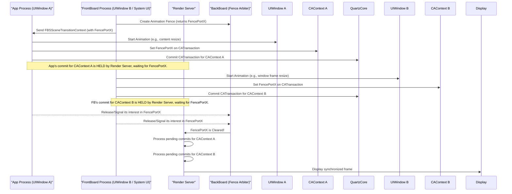

### 6. The Render Server, Compositing, and Display Hardware

The Render Server (`backboardd` on iOS, `WindowServer` on macOS) is responsible for taking the rendered output of all active `CAContext`s and compositing them together into the final image that is sent to the display hardware.

#### 6.1. The Render Server: Conceptual Overview
*   **Central Compositor:** The Render Server is the ultimate authority on what appears on screen.
*   **Receives `CAContext` Updates:** When a `CATransaction` is committed for a `CAContext` (and any associated fences are cleared), the Render Server receives the updated layer tree or backing store associated with that `contextID`.
*   **Hardware Acceleration:** It leverages the GPU for compositing, transformations, and animations to achieve high performance.
*   **Manages Frame Buffers:** It manages the buffers that are ultimately scanned out to the display.

#### 6.2. `CAContext` as the Unit of Composition
From the Render Server's perspective, each `CAContext` (identified by its unique `contextID`) is an independent source of pixels or a description of a layer tree to be rendered.

*   FrontBoard, through its management of `FBScene` objects and their associated `FBSCAContextSceneLayer`s (which carry `contextID`s), tells the Render Server which contexts to draw, where to draw them (frame), their Z-order (level), opacity, and any transforms.
*   The Render Server then takes the content from each specified `CAContext` and composites them together according to these instructions. This includes applying inter-context effects like opacity and potentially some transformations.

#### 6.3. Display Abstractions: `FBSDisplayIdentity` and `FBSDisplayConfiguration`
FrontBoardServices provides abstractions for physical displays:

*   **`FBSDisplayIdentity`**: An immutable identifier for a logical display that remains consistent as long as the display is connected. It distinguishes between main, external, and other display types.
*   **`FBSDisplayConfiguration`**: A snapshot of a display's current state and capabilities, including:
    *   Its `identity`.
    *   Hardware identifiers, name.
    *   `currentMode` and `preferredMode` (`FBSDisplayMode` objects).
    *   Overscan information (`overscanCompensation`, `safeOverscanRatio`).
    *   Layout properties in reference space (`nativeCenter`, `nativeOrientation`, `pixelSize`, `scale`, `bounds`).
    *   Color properties (`colorGamut`).

The `CADisplay` class in QuartzCore is the lower-level counterpart, and `FBSDisplayConfiguration` often wraps or derives its information from a `CADisplay`.

#### 6.4. `FBDisplayManager` and `FBSDisplayLayout`: Arranging Content on Displays
The system needs to manage how scenes and other UI elements are arranged on potentially multiple displays.

*   **`FBDisplayManager` (FrontBoard) / `FBSDisplayMonitor` (FrontBoardServices):** These classes allow observing display connections, disconnections, and configuration updates. `FBDisplayManager` is the system-side singleton.
*   **`FBSDisplayLayout`:** Describes the current layout of a specific display. It includes:
    *   The `displayConfiguration` it applies to.
    *   The current `interfaceOrientation` of the layout.
    *   An array of `elements` (`FBSDisplayLayoutElement` or subclasses). These elements represent items like application scenes, system UI panels (e.g., Status Bar, Control Center), etc. Each element has a `frame` (interface-oriented) and a `level`.
    *   The `bounds` of the layout (interface-oriented) and `referenceBounds` (portrait-up).
*   **`FBSDisplayLayoutMonitor`:** Allows clients to observe changes to the `FBSDisplayLayout` for a particular display type.
*   **`FBDisplayLayoutTransition`:** Used by FrontBoard to batch changes to a display's layout, reducing IPC and allowing observers to see the final state rather than intermediate transient states.

When an application's scene needs to be shown, FrontBoard's `FBDisplayManager` and associated layout logic determine its `frame` and `level` within the target `FBSDisplayLayout`, effectively positioning its `CAContext` in the global composite.

#### 6.5. Final Output: From Composited Scene to Pixels
Once the Render Server has composited all visible `CAContext`s according to their scene settings (frame, level, opacity, transform, etc.) and display layout, the resulting bitmap is placed into a frame buffer. This frame buffer is then synchronized with the display hardware's refresh cycle (e.g., via V-sync, managed by `CVDisplayLink` or similar mechanisms at a lower level) to be shown to the user.

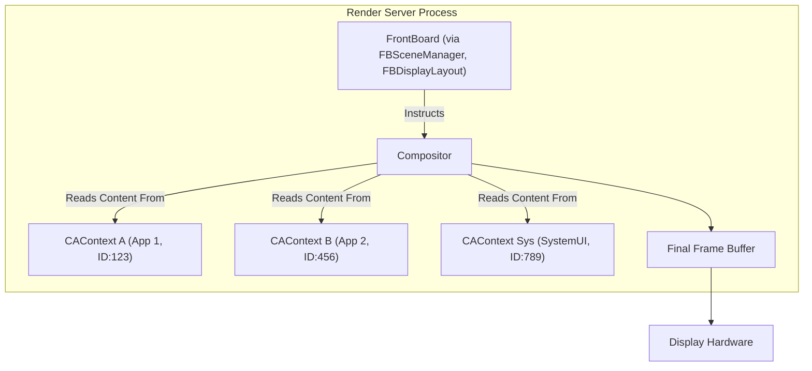

### 7. Input Event Handling in the Rendering Context

The rendering context of a window is not only for drawing but also for receiving input events targeted at its content.

#### 7.1. BackBoardServices and `BKSHIDEvent`
BackBoardServices is responsible for managing raw hardware input events (touches, keyboard, etc.).

*   **`BKSHIDEvent`**: Represents a hardware input event.
*   **Event Routing by `contextID`**: A crucial function, `BKSHIDEventGetContextIDFromEvent`, retrieves the `contextID` associated with an event. This means that the low-level input system is aware of which `CAContext` was under the touch point or has keyboard focus.
*   **`BKSEventFocusManager`**: Located in `backboardd`, this manages which `contextID` (and by extension, which application window) currently has input focus. It can defer events or redirect them based on this focus state. `UIWindow` interacts with this manager (e.g., via `_beginKeyWindowDeferral` and `_endKeyWindowDeferral`) to inform the system about which context should receive primary input.
*   **Inter-Process Dispatch**: Private `BKSHIDEvent` mechanisms (like `BKSHIDEventSendToApplicationWithBundleIDAndPid`) show that `backboardd` directly dispatches events to specific application processes if needed, though typically events are routed through the focused `contextID` and then to the owning application.

#### 7.2. `UIWindow` as the Event Target
1.  BackBoardServices determines the `contextID` associated with an incoming HID event (e.g., a touch down).
2.  This `contextID` corresponds to a `CAContext` managed by a specific `UIWindow` (usually the key window or the window under the touch).
3.  The event is delivered to the application process that owns this `CAContext`.
4.  The `UIWindow` instance associated with that `CAContext` receives the event (e.g., in its `sendEvent:` method).
5.  The `UIWindow` then performs hit-testing within its `UIView` hierarchy to determine which `UIView` (or other `UIResponder`) should ultimately handle the event. For touches, this involves converting the touch location into the coordinate spaces of its subviews.
6.  Gesture recognizers attached to views in the window get a chance to process the event before or alongside direct responder chain delivery.

This linkage through `contextID` ensures that input events are correctly targeted to the application and the specific part of its UI that is currently visible and interactive at the event's location or has focus.

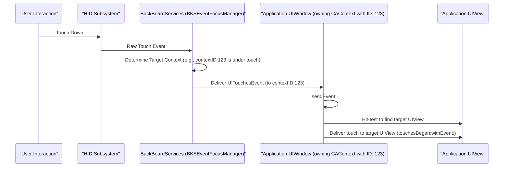

### 8. Specialized Rendering Paths and Considerations

While the primary rendering path involves UIKit views drawing into `CALayer`s which are then part of a `CAContext` managed by a `UIWindow` and an `FBSScene`, iOS provides specialized paths for performance-critical or unique scenarios.

#### 8.1. Direct GPU Rendering: `CAMetalLayer` and `CAOpenGLLayer`
For applications requiring maximum graphics performance, such as games or advanced visualization tools, UIKit views can host `CAMetalLayer` or `CAOpenGLLayer` instances.

*   These specialized layers provide a direct bridge to the Metal and OpenGL graphics APIs, respectively.
*   Instead of relying on `CALayer`'s `contents` property or `drawInContext:`, the application obtains a drawable surface (e.g., an `id<CAMetalDrawable>`) from the layer and issues rendering commands directly to the GPU using the chosen graphics API.
*   The rendered output is then managed by the `CAMetalLayer` or `CAOpenGLLayer` and integrated into the normal `CALayer` compositing tree by the Render Server.
*   These layers are still part of a `CAContext` and an `FBSScene`, so their overall on-screen presence, size, and layering are managed by FrontBoard like any other content.

#### 8.2. Hosted UIKit Environments (UIKitSystemAppServices)
The `UIKitSystemAppServices.framework` suggests a model where a "thin" UIKit client application (perhaps an app extension or a sandboxed component) runs its UI within a scene whose lifecycle and geometry are largely dictated by a host process (the main system application, like SpringBoard).

*   The client (`USSServicesClient`) checks in with the system app, providing its parent process ID and initial scene size.
*   The system app can then send requests like `USSSceneResizeRequest` to the client to change its scene's dimensions or `USSSceneActiveRequest` to inform it of its visibility state.
*   The client UIKit instance would then adjust its `UIWindow` and view hierarchy accordingly.
*   The underlying rendering would still involve the client's `UIWindow` managing a `CAContext`, with its `contextID` being the handle used by the hosting system app (via its own FrontBoard/FBScene mechanisms) to display the client's content.
*   Synchronization, possibly involving `BKSAnimationFenceHandle` passed in replies (e.g., `USSSceneResizeReply`'s `extractFencePort`), would ensure smooth visual transitions during host-initiated changes.

This model allows for sandboxed or modular UI components to be managed and displayed by a central system authority, leveraging the same core rendering primitives (`CAContext`, scenes) but with a different control flow for scene management.

#### 8.3. Scene Snapshots for System Operations
FrontBoard and FrontBoardServices include extensive support for scene snapshots (`FBSceneSnapshot`, `FBSSceneSnapshotContext`, `FBSSceneSnapshotAction`, `FBSDeleteSceneSnapshotsAction`).

*   The system can request snapshots of an application's scene content. This is used for various purposes, such as:
    *   The App Switcher.
    *   Saving state before an application is suspended.
    *   Providing placeholder UI while an application is launching.
*   An `FBSSceneSnapshotContext` defines the parameters for the snapshot (e.g., frame, scale, layers to exclude).
*   An `FBSSceneSnapshotAction` can be sent to an application's `FBSScene` to request that it perform one or more snapshots based on `FBSSceneSnapshotRequest`s.
*   The resulting snapshot (often an `IOSurfaceRef` or `CGImageRef` encapsulated in `FBSceneSnapshot`) can then be used by the system.

This snapshotting mechanism relies on the Render Server's ability to capture the current state of a `CAContext`.

### 9. Conclusion and Key Interaction Visualizations

#### 9.1. Summary of Rendering Flow
The iOS rendering pipeline is a sophisticated, multi-process system designed for efficiency, fluidity, and robust management of application and system UI.

1.  **Application UI Definition:** Apps use UIKit (`UIView`, `UIWindow`) to define their interface, which is backed by a QuartzCore `CALayer` tree.
2.  **`CAContext` as the Render Target:** Each `UIWindow` renders its `CALayer` tree into an associated `CAContext`, which has a unique `contextID`.
3.  **Scene Management (FrontBoardServices/FrontBoard):**
    *   The app's `UIWindow` and its `CAContext` are represented to the system as an `FBSScene` containing an `FBSCAContextSceneLayer` (which holds the `contextID`).
    *   FrontBoard (the system server) manages an `FBScene` counterpart, using the `contextID` to display the app's content via an `FBSceneHostView` (leveraging remote layer capabilities of QuartzCore).
    *   Settings (`FBSSceneSettings`, `FBSSceneClientSettings`) are synchronized between the app and FrontBoard to manage scene properties like frame, orientation, and visibility.
4.  **Transactions and Animation:**
    *   `CATransaction` batches `CALayer` property changes.
    *   `CAAnimation` drives time-based property changes.
    *   `FBSSceneTransitionContext` manages scene state transitions, often including animation parameters.
5.  **Synchronization (`BKSAnimationFenceHandle`):** Fences are used to coordinate `CATransaction` commits across different `CAContext`s (and potentially processes), ensuring visually coherent animations and updates. `UIWindow` actively participates in fence creation and application.
6.  **Render Server and Compositing:** The Render Server receives updates from all active `CAContext`s and composites them based on instructions from FrontBoard (derived from scene settings and display layouts) into the final frame buffer.
7.  **Input Routing (BackBoardServices):** Hardware events are captured and routed by BackBoardServices to the appropriate `CAContext` (and thus the application) based on the `contextID` and system focus state.

This architecture allows for a clear separation of concerns, enabling applications to focus on their content while the system manages global UI orchestration, resource allocation, and efficient rendering.

#### 9.2. Visualized Scenarios

##### 9.2.1. Application Launch and Initial Frame

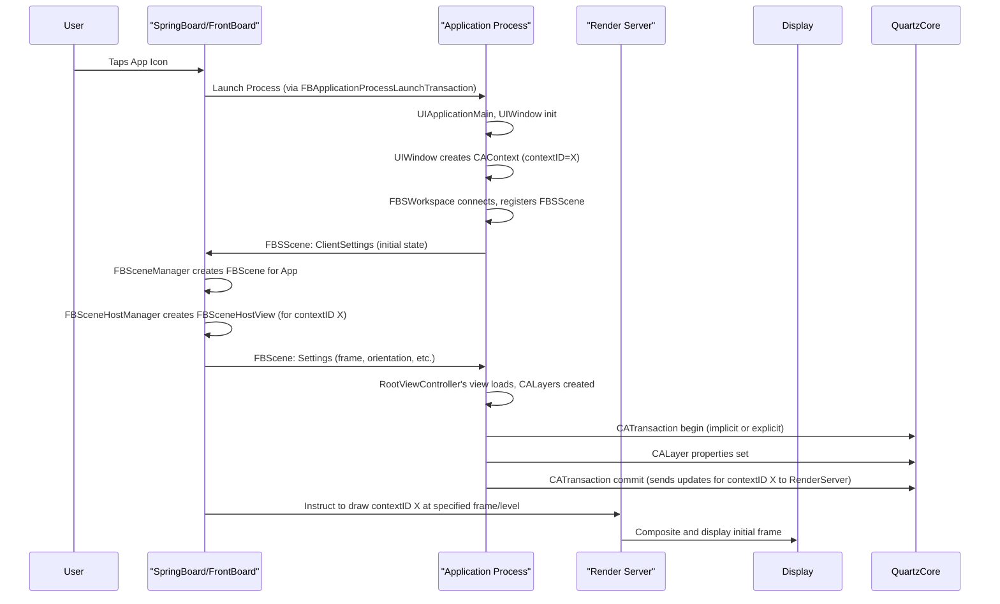

##### 9.2.2. View Property Animation (e.g., `UIView.animate`)

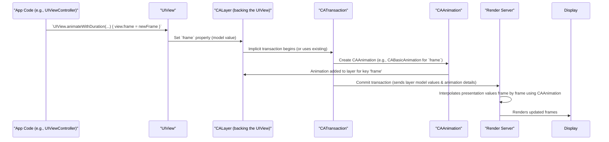

##### 9.2.3. Window Resize and Orientation Change (Simplified)

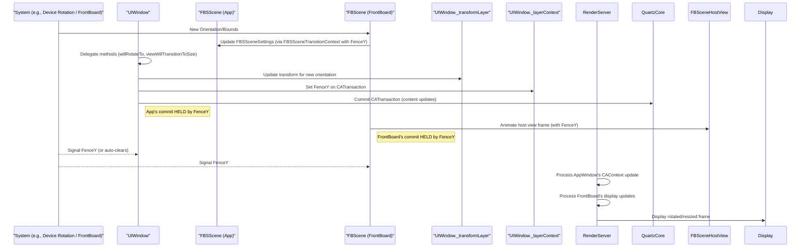

##### 9.2.4. Synchronized Cross-Process Transition (e.g., App Opening)

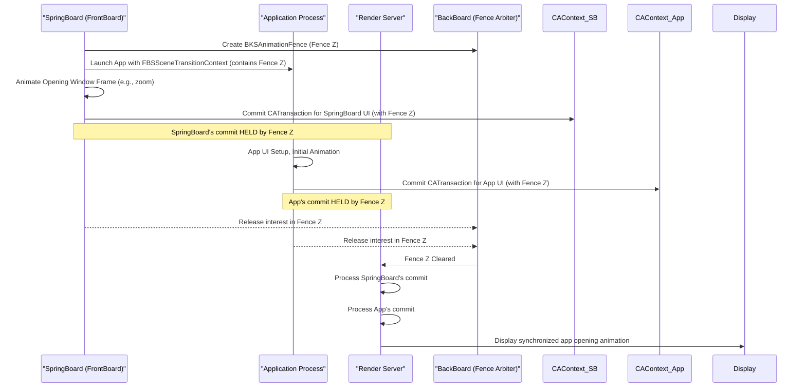

```mermaid
gantt
    dateFormat  HH:mm
    axisFormat %H:%M

    section SpringBoard
    Create Fence Z           :done, sb_fence, 00:00, 10m
    Commit UI (held)         :active, sb_commit, after sb_fence, 30m
    Release Fence Z          :done, sb_release, after sb_commit, 5m

    section Application
    Setup UI                 :done, app_setup, 00:10, 10m
    Commit UI (held)         :active, app_commit, after app_setup, 30m
    Release Fence Z          :done, app_release, after app_commit, 5m

    section BackBoard
    Fence Z Cleared          :milestone, bb_clear, 01:00,

    section Render Server
    Process Commits          :done, rs_process, after bb_clear, 10m
    Display App Launch       :done, rs_display, after rs_process, 10m
```