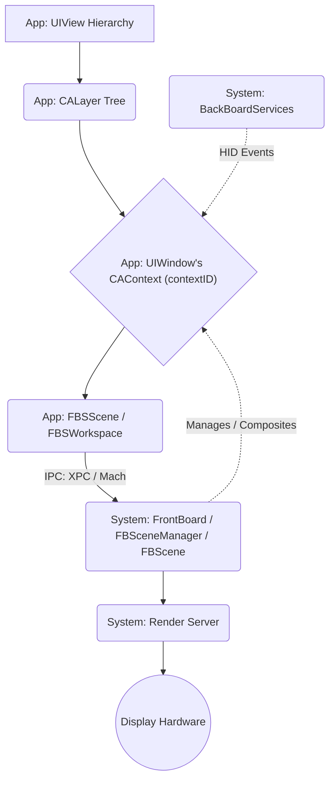
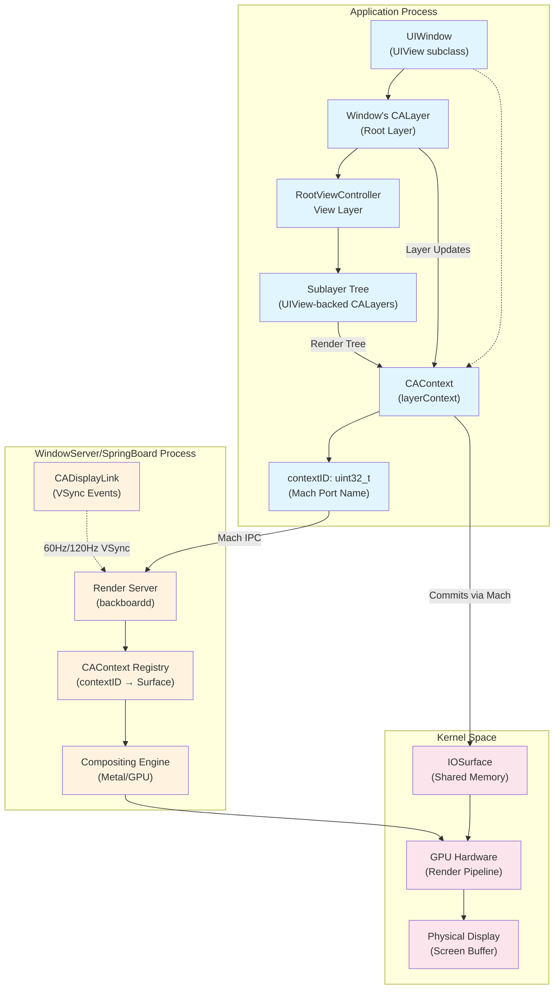
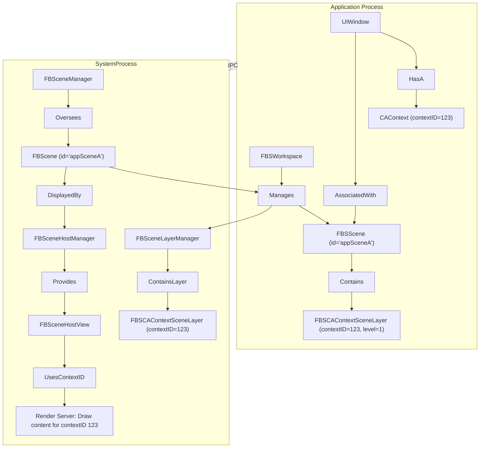
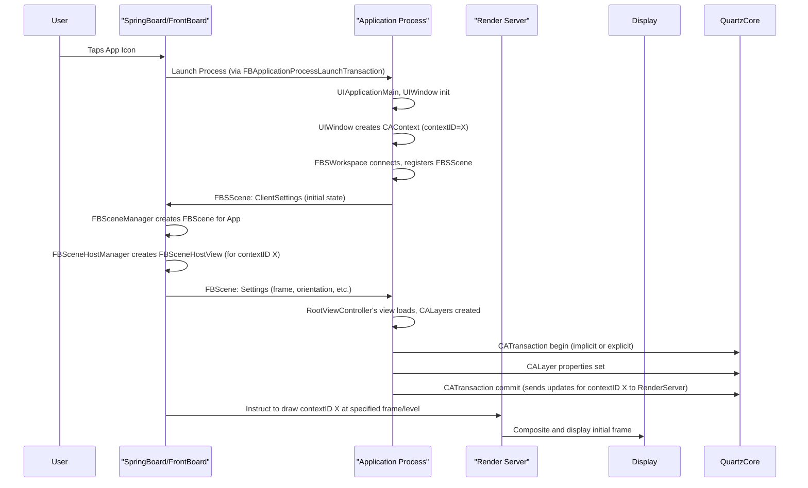

## iOS Application Rendering: A Deep Dive

This document provides an exploration of the iOS application rendering pipeline, from high-level UIKit API calls to the final presentation of pixels on the physical display. Areas of discussion include layer-based compositing, scene management, rendering and state synchronization, animation coordination, and input event handling.

---

**Table of Contents**

1. **Introduction & Architectural Overview**  
    1.1. Purpose  
    1.2. Core Rendering Paradigm  
    1.3. Key Abstractions: Views, Layers, Contexts, and Scenes  
    1.4. The Client-Server Model for UI Management  
    1.5. High-Level Rendering Flow  

2. **UIKit Interface and Layer Fundamentals**  
    2.1. UIKit: The Application's Interface  
        2.1.1. `UIView`: The Building Block  
        2.1.2. `UIWindow`: The Root and System Interface  
        2.1.3. Mapping View Properties to Layers  
    2.2. QuartzCore Foundation: CALayer and CAContext  
        2.2.1. `CALayer`: The Atomic Unit of Rendering  
        2.2.2. `CAContext`: The Bridge to the Render Server  
        2.2.3. The Significance of the `contextID`  

3. **Scene Management Architecture**  
    3.1. The Scene Abstraction and Client-Server Model  
    3.2. Scene Content Association via `FBSCAContextSceneLayer`  
    3.3. Scene State Synchronization and Communication  
    3.4. Scene Hosting and Remote Rendering  
    3.5. Transactional Operations and Scene Lifecycle  

4.  **Synchronization, Animation, and Cross-Process Coordination**  
    4.1. `CATransaction` and `CAAnimation` Fundamentals  
    4.2. `FBSSceneTransitionContext`: Coordinated Scene State Changes  
    4.3. `BKSAnimationFenceHandle`: Ensuring Visual Cohesion  

5.  **The Render Server, Compositing, and Display Hardware**  
    5.1. The Render Server: Conceptual Overview  
    5.2. Display Abstractions and Layout Management  
    5.3. Final Output: From Composited Scene to Pixels  

6.  **Input Event Handling in the Rendering Context**  
    6.1. BackBoardServices and `BKSHIDEvent`  
    6.2. `UIWindow` as the Event Target  

7.  **Specialized Rendering Paths and Considerations**  
    7.1. Direct GPU Rendering: `CAMetalLayer` and `CAOpenGLLayer`  
    7.2. Hosted UIKit Environments (UIKitSystemAppServices)  
    7.3. Scene Snapshots for System Operations 

8.  **Conclusion and Key Interaction Visualizations**  
    8.1. Summary of Rendering Flow  
    8.2. Visualized Scenarios  

---

### 1. Introduction & Architectural Overview

#### 1.2. Core Rendering Paradigm
iOS employs a sophisticated, layer-based compositing model. Applications construct a hierarchy of layers, each representing a distinct piece of visual content. These layer trees are then managed, composited, and rendered by system services to produce the final image seen by the user. This architecture allows for efficient updates, complex animations, and seamless integration of UI from multiple sources (e.g., different applications, system UI).

#### 1.3. Key Abstractions: Views, Layers, Contexts, and Scenes
The rendering system is built upon several key abstractions:

*   **`UIView` (UIKit):** The primary object applications use to define and manage UI elements and their event handling.
*   **`CALayer` (QuartzCore):** The backing for every `UIView`, `CALayer` is the fundamental unit for 2D and 3D drawing, animation, and compositing. It holds content (like an image or custom drawing) and visual attributes.
*   **`CAContext` (QuartzCore):** Represents an independent rendering destination managed by the system's Render Server. Each `UIWindow` typically manages a `CAContext` into which its `CALayer` tree is rendered. A `CAContext` is identified by its `contextID`.
*   **`FBSScene` / `FBScene` (FrontBoardServices/FrontBoard):** An abstraction representing a managed area on a display where an application can present its content. An `FBSScene` is the application's handle to this managed area, while an `FBScene` is the system-side (FrontBoard) representation.

#### 1.4. The Client-Server Model for UI Management
UI presentation and window management in iOS operate on a client-server model:

**Client Side (Application Process):**  

*   **`FBSScene` (FrontBoardServices):** The application-side object representing a scene. Applications interact with `FBSScene` objects to manage settings, send actions, and respond to system-initiated updates.
*   **`FBSWorkspace`:** The primary channel for scene communication with the system, allowing apps to enumerate existing scenes, request creation/destruction of scenes, and receive lifecycle events via `FBSWorkspaceDelegate`.

**Server Side (FrontBoard / SpringBoard):**
  
*   **`FBScene` (FrontBoard):** The server-side counterpart managing the scene within the system. FrontBoard manages collections of `FBScene` objects representing all active scenes from various applications and system services.
*   **`FBSceneManager`:** The core object overseeing all `FBScene` instances, handling creation/destruction requests, settings adjudication, and observer notifications.

This separation allows the system to manage resources and overall UI coherence, while applications focus on their specific content and interactions.

#### 1.5. High-Level Rendering Flow
A simplified view of the rendering flow is as follows:

1.  An application, using UIKit, constructs a view hierarchy (`UIView` instances).
2.  Each `UIView` is backed by a `CALayer`, forming a compositing tree.
3.  The `UIWindow`'s `CALayer` tree is rendered into a `CAContext` managed by the window.
4.  The application, via FrontBoardServices (`FBSScene`, `FBSWorkspace`), requests to present this `CAContext` (identified by its `contextID`) to FrontBoard, which operates inside SpringBoard.
5.  FrontBoard (`FBSceneManager`, `FBScene`) receives this request and manages the "hosting" of the application's `CAContext`. It instructs the Render Server.
6.  The CoreAnimation Render Server composites the content from various `CAContext`s (from the app, other apps, system UI) into a final frame buffer.
7.  The frame buffer is sent to the display hardware.

### 2. UIKit Interface and Layer Fundamentals

#### 2.1. UIKit: The Application's Interface

UIKit provides the high-level framework for application development, abstracting many of the complexities of direct graphics manipulation and system interaction.

##### 2.1.1. `UIView`: The Building Block
`UIView` is the cornerstone of an application's user interface. Developers create instances of `UIView` (or its subclasses like `UILabel`, `UIButton`, `UIImageView`) to represent distinct visual elements. Key aspects include:

*   **Hierarchy:** Views are arranged in a tree structure, with a superview and multiple subviews. This hierarchy dictates drawing order (subviews are drawn on top of their superview) and event propagation.
*   **Geometry:** Properties like `frame` (position and size in superview's coordinates), `bounds` (local drawing rectangle), and `transform` (affine transform relative to its center) define a view's spatial characteristics.
*   **Appearance:** Properties like `backgroundColor`, `alpha` (opacity), and `isHidden` control visual presentation.
*   **Drawing:** Custom drawing is achieved by overriding `drawRect:`. When a view needs to be redrawn (e.g., due to `setNeedsDisplay` being called), UIKit sets up a graphics context and invokes this method.
*   **Event Handling:** Views are `UIResponder` subclasses, capable of handling touch events, motion events, and other input.

##### 2.1.2. `UIWindow`: The Root and System Interface
`UIWindow` is a specialized `UIView` subclass that serves as the top-level container for an application's view hierarchy. It doesn't typically have visible content itself but acts as a bridge to the system's windowing and rendering infrastructure.

*   **Root View Controller:** A `UIWindow` usually has a `rootViewController`, whose view becomes the primary content view of the window.
*   **Screen Association:** A `UIWindow` is associated with a `UIScreen`, determining which physical display it will appear on.
*   **Window Level:** The `windowLevel` property (e.g., `UIWindowLevelNormal`, `UIWindowLevelStatusBar`, `UIWindowLevelAlert`) dictates its Z-ordering relative to other windows on the screen. System services use this for global UI layering.
*   **Key Window Status:** Only one window at a time is the "key window." The key window receives keyboard and non-touch-related UI events. Making a window key (`makeKeyAndVisible`) involves communication with system services.
*   **Interface Orientation:** The `UIWindow`, often in conjunction with its `rootViewController` and application settings, manages the interface orientation of its content.

##### 2.1.3. Mapping View Properties to Layers
Every `UIView` instance is backed by a `CALayer` object. Changes to `UIView` properties are typically translated into corresponding changes on its underlying `CALayer`.

#### 2.2. QuartzCore Foundation: CALayer and CAContext

QuartzCore provides the `CALayer` class and `CAContext` infrastructure for hardware-accelerated compositing and animation. This foundation bridges UIKit's view-based interface with the system's render server.

##### 2.2.1. `CALayer`: The Atomic Unit of Rendering
`CALayer` is the fundamental object that QuartzCore uses to represent 2D and 3D content. Unlike `UIView`, `CALayer` is not a `UIResponder` and does not handle user interaction directly; its focus is solely on content presentation and animation.

**Layer Geometry and Hierarchy:** 
 
*   **`bounds`**: The layer's drawing rectangle in its own coordinate system.
*   **`position`**: The position of the layer's `anchorPoint` in its superlayer's coordinate system.
*   **`anchorPoint`**: A normalized point (0,0 to 1,1) within the layer that `position` refers to and around which transformations (like rotation) occur. Defaults to (0.5, 0.5), the center.
*   **`transform` (`CATransform3D`)**: An arbitrary 3D transformation matrix applied to the layer and its sublayers.
*   **`frame`**: A derived property representing the layer's extent in its superlayer's coordinate system, calculated from `bounds`, `position`, `anchorPoint`, and `transform`.

**Layer Content and Visual Effects:**
A `CALayer` can display content through multiple mechanisms:

*   **`contents` property**: Can be assigned a `CGImageRef` (or platform-specific types like `IOSurfaceRef`). This image is drawn into the layer's bounds, respecting `contentsGravity`, `contentsScale`, and `contentsRect`.
*   **Custom Drawing (`drawInContext:`)**: A `CALayer` subclass can override `drawInContext:`, or its delegate can implement `drawLayer:inContext:`. Core Animation creates a graphics context (`CGContextRef`) representing the layer's backing store when content updates are needed.

**Specialized CALayer Subtypes:**
QuartzCore offers specialized `CALayer` subclasses for specific rendering tasks, including:

*   **`CAMetalLayer` / `CAOpenGLLayer`**: Provide surfaces for direct GPU rendering, critical for games and graphics-intensive applications.
*   **`CATiledLayer`**: Efficiently draws very large content by breaking it into tiles loaded on demand.
*   **`CALayerHost`**: Displays content of a `CAContext` from potentially another process, identified by its `contextID`. Fundamental for remote hosting.

##### 2.2.2. `CAContext`: The Bridge to the Render Server
A `CAContext` is the object that embodies an independent rendering surface and layer tree managed by the system's Render Server. Each `UIWindow` typically creates and manages its own `CAContext`, into which its entire `CALayer` tree is rendered.

**The Significance of the `contextID`:**
The `contextID` property of a `CAContext` is a unique 32-bit integer token assigned by Core Animation that serves as the bridge between an application's UI and the system's rendering infrastructure. It is not itself a Mach port name, but can be mapped by Core Animation to the underlying Mach port or surface reference used for remote hosting:

*   **Render Server Identification:** It's how the Render Server (a separate system process) identifies and manages the specific drawing surface associated with that part of the application's UI.
*   **Inter-Process Referencing:** System services (like FrontBoard within SpringBoard) use this `contextID` to refer to and manipulate an application's renderable content without needing direct access to the app's `CALayer` objects. This enables remote hosting and scene management.
*   **Event Routing:** BackBoardServices uses the `contextID` of the focused window/layer to route touch and other hardware events to the correct application and specific part of its UI.

For standard applications, the context associated with a `UIWindow` is effectively a remote rendering target managed by the system, where rendering commands are sent to the Render Server for compositing.

### 3. Scene Management Architecture

While `CAContext` provides a renderable surface, the *management* of an application's overall presence on screen, its lifecycle, and its interaction with other UI elements is handled at a higher level by "Scenes," orchestrated by FrontBoard using a client-server architecture.

#### 3.1. The Scene Abstraction and Client-Server Model

iOS uses a scene-based model for managing application UI, where each scene represents a distinct, manageable unit of an application's interface.

The core client–server relationships and their responsibilities were outlined in §1.4. Building on that foundation, this section focuses on how scene content is bound to rendering surfaces, beginning with the association of a `UIWindow`’s `CAContext` to its `FBSScene`.

#### 3.2. Scene Content Association via `FBSCAContextSceneLayer`

The critical link between a `UIWindow`'s `CAContext` and the scene management system occurs through scene layers:

*   When a `UIWindow` is made visible and associated with an `FBSScene`, its `_layerContext` (a `CAContext`) is represented within that `FBSScene` as an `FBSCAContextSceneLayer`.
*   The `FBSCAContextSceneLayer` carries the `contextID` of the window's `CAContext`.
*   This `contextID` is the critical piece of information that allows FrontBoard (managing the server-side `FBScene`) to identify and display the actual rendered content from the application's process.

Additional layer types include `FBSExternalSceneLayer`, which allows one scene to embed content from another scene (identified by its `sceneID`), enabling features like Picture-in-Picture or Split View.

#### 3.3. Scene State Synchronization and Communication

The state and appearance of scenes are managed through settings objects synchronized between the application (client) and FrontBoard (server):

**Settings Objects:**  

*   **`FBSSceneSettings` (Server-Controlled):** Describe the system-imposed state including `displayIdentity`, `frame`, `level` (Z-ordering), `interfaceOrientation`, `backgrounded` status, and `occlusions`.
*   **`FBSSceneClientSettings` (Client-Controlled):** Communicate the application's preferences including `preferredLevel`, `preferredInterfaceOrientation`, and internal `occlusions`.

**Efficient Updates:**
Changes are transmitted as diff objects (`FBSSceneSettingsDiff`, `FBSSceneClientSettingsDiff`) with inspectors allowing observers to efficiently determine which specific settings changed.

**Communication Flow:**
When an application updates its `FBSSceneClientSettings`, FrontBoard processes the request, updates its server-side `FBSceneSettings` if valid, and propagates changes back to the application. The `FBSWorkspace` serves as the primary communication channel, handling scene enumeration, creation/destruction requests, and lifecycle events via `FBSWorkspaceDelegate`.

#### 3.4. Scene Hosting and Remote Rendering

The server-side scene management enables remote rendering through several key components:

**FBSceneLayerManager:** Each `FBScene` maintains an ordered set of `FBSSceneLayer` objects, primarily `FBSCAContextSceneLayer` (representing main content) and `FBSExternalSceneLayer` (for embedded content from other scenes).

**FBSceneHostManager:** Responsible for actual presentation of scene content within FrontBoard's UI hierarchy. It manages requests from multiple "requesters" wanting to display the scene content and provides `FBSceneHostView` instances.

**FBSceneHostView:** A `UIView` subclass within SpringBoard (where FrontBoard lives) that displays client application scene content using the `contextID` from the `FBSCAContextSceneLayer`. The `FBSceneHostAppearance` protocol defines rendering properties like `renderingMode`, `minificationFilterName`, and `appearanceStyle`.

#### 3.5. Transactional Operations and Scene Lifecycle

FrontBoard uses its own transaction system, built upon `BSTransaction` from BaseBoard, to manage complex operations involving multiple steps or asynchronous work:

*   **`FBTransaction`:** Base class for FrontBoard-specific transactions.
*   **`FBApplicationProcessLaunchTransaction`:** Manages application process launch as part of scene updates.
*   **`FBUpdateSceneTransaction`:** Coordinates single scene updates, including settings changes and client commit synchronization.
*   **`FBApplicationUpdateScenesTransaction`:** Comprehensive transaction managing application launch and creation/update of multiple scenes simultaneously, often acting as a synchronized group (`FBSynchronizedTransactionGroup`).

These transactions ensure operations like app opening and initial UI display occur in a coordinated, well-defined manner. The underlying remote layer architecture uses `CARemoteLayerClient` and `CARemoteLayerServer` mechanisms, where the `contextID` serves a similar purpose to `clientId` in efficiently referencing and compositing layer trees from different processes.

### 4. Synchronization, Animation, and Cross-Process Coordination

Smooth UI and animations, especially during transitions involving multiple processes, require careful coordination. iOS employs several layers of transactional and synchronization mechanisms.

#### 4.1. `CATransaction` and `CAAnimation` Fundamentals

**`CATransaction`** is the fundamental mechanism in QuartzCore for batching changes to `CALayer` properties and ensuring they are applied atomically to the render tree:

*   **Implicit Transactions:** Most `CALayer` property changes made on the main thread are automatically wrapped in an implicit transaction, typically committed at the end of the current run loop cycle.
*   **Explicit Transactions:** Developers can use `[CATransaction begin]` and `[CATransaction commit]` to define explicit transaction scopes. `[CATransaction flush]` can force an implicit transaction to commit earlier.
*   **Animation Properties:** `CATransaction` allows setting per-transaction properties like `animationDuration`, `animationTimingFunction`, `completionBlock`, and `disableActions`.

**`CAAnimation`** and its subclasses (`CABasicAnimation`, `CAKeyframeAnimation`, `CASpringAnimation`, `CAAnimationGroup`, `CATransition`) define how layer properties change over time. Animations are added to layers using `-[CALayer addAnimation:forKey:]` and control interpolation from current presentation values to new model values.

#### 4.2. `FBSSceneTransitionContext`: Coordinated Scene State Changes

When an application or FrontBoard initiates a change to scene settings (e.g., resizing a window, changing its orientation, or activating a scene), these changes are often bundled within an `FBSSceneTransitionContext`:

*   **`animationSettings` (`BSAnimationSettings`)**: Specifies the duration, delay, and timing function (including spring parameters) for how the scene's visual representation should transition to the new state.
*   **`actions` (`NSSet<BSAction *>`)**: A set of `BSAction` objects to be delivered to the scene's client or host as part of the transition.
*   **`animationFence` (`BKSAnimationFenceHandle`)**: An animation fence to synchronize the transition.

#### 4.3. `BKSAnimationFenceHandle`: Ensuring Visual Cohesion

`BKSAnimationFenceHandle` (also seen as `FBSCAFenceHandle`) is a CoreAnimation/BackBoard mechanism for synchronizing rendering updates across processes or CAContexts so that complex transitions appear visually aligned.

**Purpose:** When a complex UI transition involves multiple independent entities animating (e.g., an application animating its content while the system animates the window frame), fences ensure resulting frames are presented in the same display refresh, avoiding tearing or phase mismatches.

**Mechanism:**  

1. A fence handle is a reference to a system-managed synchronization primitive.
2. A `CAContext` can create a new fence via `createFencePort`. On older iOS this returns a Mach port; on newer versions it may return an XPC-wrapped fence descriptor.
3. The fence handle can be wrapped in a `BKSAnimationFenceHandle` and passed to other processes or subsystems.
4. Associating the fence with a `CATransaction` (via `setFencePort:`) prevents the transaction’s commits from being displayed by the Render Server until the fence is signaled or released.

**`UIWindow` Coordination:**
`UIWindow` methods such as `_synchronizeDrawingWithFence:preCommitHandler:` and `_synchronizeDrawingAcrossProcessesOverPort:` attach these fences to its `CAContext` commits, ensuring that updates from multiple processes reach the screen in the same vsync cycle.

### 5. The Render Server, Compositing, and Display Hardware

The Render Server (`backboardd` on iOS, `WindowServer` on macOS) is responsible for taking the rendered output of all active `CAContext`s and compositing them together into the final image that is sent to the display hardware.

#### 5.1. The Render Server: Conceptual Overview
*   **Central Compositor:** The Render Server is the ultimate authority on what appears on screen.
*   **Receives `CAContext` Updates:** When a `CATransaction` is committed for a `CAContext` (and any associated fences are cleared), the Render Server receives the updated layer tree or backing store associated with that `contextID`.
*   **Hardware Acceleration:** It leverages the GPU for compositing, transformations, and animations to achieve high performance.
*   **Manages Frame Buffers:** It manages the buffers that are ultimately scanned out to the display.

From the Render Server's perspective, each `CAContext` (identified by its unique `contextID`) is an independent source of pixels or a description of a layer tree to be rendered. FrontBoard, through its management of `FBScene` objects and their associated `FBSCAContextSceneLayer`s, tells the Render Server which contexts to draw, where to draw them (frame), their Z-order (level), opacity, and any transforms.

#### 5.2. Display Abstractions and Layout Management

**Display Abstractions:**  

*   **`FBSDisplayIdentity`**: An immutable identifier for a logical display that remains consistent as long as the display is connected.
*   **`FBSDisplayConfiguration`**: A snapshot of a display's current state and capabilities, including hardware identifiers, display modes, overscan information, and color properties.

**Layout Management:**  

*   **`FBDisplayManager` / `FBSDisplayMonitor`:** Allow observing display connections, disconnections, and configuration updates.
*   **`FBSDisplayLayout`:** Describes the current layout of a specific display, including `displayConfiguration`, `interfaceOrientation`, and an array of `elements` (application scenes, system UI panels, etc.).
*   **`FBDisplayLayoutTransition`:** Used to batch changes to a display's layout, reducing IPC and allowing observers to see the final state.

When an application's scene needs to be shown, FrontBoard's display management determines its `frame` and `level` within the target `FBSDisplayLayout`, effectively positioning its `CAContext` in the global composite.

#### 5.3. Final Output: From Composited Scene to Pixels

Once the Render Server has composited all visible `CAContext`s according to their scene settings (frame, level, opacity, transform, etc.) and display layout, the resulting bitmap is placed into a frame buffer. This frame buffer is then synchronized with the display hardware's refresh cycle (e.g., via V-sync) to be shown to the user.

When a `CATransaction` is committed, the changes to layer properties are sent to the Render Server.

### 6. Input Event Handling in the Rendering Context

The rendering context of a window is not only for drawing but also for receiving input events targeted at its content.

#### 6.1. BackBoardServices and `BKSHIDEvent`

Located in `backboardd`, BackBoardServices is responsible for managing raw hardware input events (touches, keyboard, etc.):

*   **`BKSHIDEvent`**: Represents a hardware input event.
*   **Event routing** uses scene/layer geometry to determine the `contextID` for the target `CAContext`.
*   **`BKSEventFocusManager`**: Manages which `contextID` (and by extension, which application window) currently has input focus. `UIWindow` interacts with this manager to inform the system about which context should receive primary input.

#### 6.2. `UIWindow` as the Event Target

1. BackBoardServices determines the `contextID` associated with an incoming HID event (e.g., a touch down).
2. This `contextID` corresponds to a `CAContext` managed by a specific `UIWindow` (usually the key window or the window under the touch).
3. The event is delivered to the application process that owns this `CAContext`.
4. The `UIWindow` instance associated with that `CAContext` receives the event (e.g., in its `sendEvent:` method).
5. The `UIWindow` then performs hit-testing within its `UIView` hierarchy to determine which `UIView` should ultimately handle the event.

This linkage through `contextID` ensures that input events are correctly targeted to the application and the specific part of its UI that is currently visible and interactive.

### 7. Specialized Rendering Paths and Considerations

While the primary rendering path involves UIKit views drawing into `CALayer`s which are then part of a `CAContext` managed by a `UIWindow` and an `FBSScene`, iOS provides specialized paths for performance-critical or unique scenarios.

#### 7.1. Direct GPU Rendering: `CAMetalLayer` and `CAOpenGLLayer`

For applications requiring maximum graphics performance, such as games or advanced visualization tools, UIKit views can host `CAMetalLayer` or `CAOpenGLLayer` instances:

*   These specialized layers provide a direct bridge to the Metal and OpenGL graphics APIs, respectively.
*   Instead of relying on `CALayer`'s `contents` property or `drawInContext:`, the application obtains a drawable surface from the layer and issues rendering commands directly to the GPU.
*   The rendered output is managed by the specialized layer and integrated into the normal `CALayer` compositing tree by the Render Server.
*   These layers are still part of a `CAContext` and an `FBSScene`, so their overall on-screen presence, size, and layering are managed by FrontBoard like any other content.

#### 7.2. Hosted UIKit Environments (UIKitSystemAppServices)

The `UIKitSystemAppServices.framework` provides a model where a "thin" UIKit client application runs its UI within a scene whose lifecycle and geometry are largely dictated by a host process. The client checks in with the system app, which can send requests to change the client's scene dimensions or visibility state.

#### 7.3. Scene Snapshots for System Operations

FrontBoard and FrontBoardServices include extensive support for scene snapshots used for the App Switcher, saving state before suspension, and providing placeholder UI during app launches. The system can request snapshots of an application's scene content, which relies on the Render Server's ability to capture the current state of a `CAContext`.
### 8. Conclusion and Key Interaction Visualizations

#### 8.1. Summary of Rendering Flow

The iOS rendering pipeline is a sophisticated, multi-process system designed for efficiency, fluidity, and robust management of application and system UI:

1. **Application UI Definition:** Apps use UIKit (`UIView`, `UIWindow`) to define their interface, which is backed by a QuartzCore `CALayer` tree.
2. **`CAContext` as the Render Target:** Each `UIWindow` renders its `CALayer` tree into an associated `CAContext`, which has a unique `contextID`.
3. **Scene Management:** The app's `UIWindow` and its `CAContext` are represented to the system as an `FBSScene` containing an `FBSCAContextSceneLayer`, with FrontBoard managing the server-side `FBScene` counterpart.
4. **Synchronization and Animation:** `CATransaction` batches layer changes, `CAAnimation` drives time-based changes, and `BKSAnimationFenceHandle` coordinates cross-process animations.
5. **Render Server and Compositing:** The Render Server receives updates from all active `CAContext`s and composites them based on instructions from FrontBoard into the final frame buffer.
6. **Input Routing:** Hardware events are captured and routed by BackBoardServices to the appropriate `CAContext` based on the `contextID` and system focus state.

This architecture allows for clear separation of concerns, enabling applications to focus on their content while the system manages global UI orchestration, resource allocation, and efficient rendering.

#### 8.2. Visualized Scenarios

##### 8.2.1. Application Launch and Initial Frame

